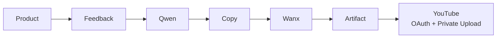

# SocialPilot AI

> 面向跨境电商团队的 AI 社媒增长与受控发布工作台，把商品、反馈、内容、视频资产和 YouTube Private 发布连接成可追溯闭环。

**当前状态：V2-L2A Competition Checkpoint Ready**

| 已验证成果 | 状态 | 评委可快速确认的证据 |
| --- | :---: | --- |
| 真实 Qwen | ✅ | Strategy、Copy、Video Blueprint 与 Recommendation 经过结构化输出和 Schema 校验 |
| 真实 Wanx | ✅ | 异步 RenderTask 完成并保存可只读播放的 Artifact |
| 真实 Google OAuth | ✅ | PKCE、state摘要、一次性 OAuthSession 与频道绑定已完成真实验收 |
| YouTube Private上传成功 | ✅ | Provider-free Preflight、幂等 PublishTask、Private状态与任务恢复已完成真实验收 |

## 一条完整、可审计的增长链



SocialPilot AI不把生成、资产和发布拆成孤立Demo：Strategy、Copy、VideoProject、RenderTask、Artifact、SocialAccount与PublishTask均保留精确关系，发布结果可以从本地审计记录恢复。

## 核心能力

| 能力 | 已实现内容 | 安全与真实性约束 |
| --- | --- | --- |
| Product与Feedback | 商品、目标市场、Campaign CSV与增长指标 | CSV完整校验后写入；CTR、CVR、CPA、ROAS由确定性代码计算 |
| Qwen内容链 | Marketing Strategy、Copy Matrix、Video Blueprint、Growth Recommendation | JSON解析和Pydantic校验通过后才持久化 |
| Wanx视频链 | RenderTask提交、显式状态查询、Artifact保存与播放 | 幂等任务；不自动重复提交；Artifact通过安全路径解析器读取 |
| YouTube账号绑定 | Google OAuth、频道身份、重新授权与本地账号恢复 | PKCE、state摘要、浏览器会话校验、一次性OAuthSession |
| YouTube Private发布 | Preflight、PublishTask、Private上传和只读历史恢复 | made-for-kids由用户选择；AI披露开启；不通知订阅者；不自动重传 |
| Presentation Mode | Product、Copy、Video与Artifact的稳定评委演示 | `0 AI Calls`；隐藏社交发布；页面访问不调用Provider、不写数据库 |

## 真实验收证据

| 验收项 | 结果 |
| --- | --- |
| Qwen真实结构化执行 | 通过 |
| Wanx真实视频生成与Artifact链 | 通过 |
| Google OAuth账号绑定 | 通过 |
| OAuth Token加密存储 | Fernet密文持久化，密钥仅来自后端本机环境 |
| OAuth防重放 | PKCE、state摘要、过期时间和一次性消费均通过 |
| YouTube Provider-free Preflight | Provider调用0、业务写入0 |
| YouTube Private上传 | 通过；使用幂等键和精确账号/Artifact关系 |
| PublishTask恢复 | 成功历史、Private状态与完成时间可在Gate关闭时只读恢复 |
| Presentation | `0 AI Calls`，Artifact播放器可用，社交区域隐藏 |

> 比赛上传验收使用独立受控、哈希验证的 Wanx Artifact；V2-L1 Live 主链验收记录独立保留，二者不混同。

## Presentation与当前边界

| 范围 | 当前状态 |
| --- | --- |
| Presentation Demo Snapshot | 已实现；只读、稳定、`0 AI Calls` |
| Presentation Artifact播放 | 已实现；复用正式Artifact metadata/content API |
| Presentation社交发布 | 完全隐藏，不产生OAuth或发布请求 |
| Instagram发布 | 尚未实现，仅显示“即将支持” |
| TikTok发布 | 尚未实现，仅显示“即将支持” |
| 自动广告投放 | 尚未实现 |
| 自动预算调整 | 尚未实现 |
| 自动发布或不确定上传重试 | 不支持，也不会后台执行 |

## 质量门禁

| 检查 | 结果 |
| --- | --- |
| Backend pytest | `515 passed, 3 skipped` |
| V2-L2A定向pytest | `32 passed` |
| Frontend Social | `20 checks passed` |
| Live Wanx frontend | `5 scenarios passed` |
| Presentation Artifact | passed |
| Ruff / TypeScript / Vite production build | passed |
| UTF-8 / Markdown links / `git diff --check` | passed |
| 新增行敏感信息扫描 | 0 findings |

普通测试与前端门禁不调用真实Google、YouTube、Qwen或Wanx；真实Provider验收通过独立、受监督流程完成。

## 技术架构

```text
React + TypeScript + Vite
              ↓
FastAPI + Pydantic API
              ↓
Business Services / State Machines / Preflight
              ↓
Repositories + SQLAlchemy + SQLite
              ↓
Qwen Provider / Wanx Provider / YouTube Provider / Artifact Storage
```

- 模块化单体，按API、Schema、Service、Repository、Model和Provider分层。
- 后端Feature Gate是外部操作的最终安全边界；前端Gate只负责UI。
- Presentation复用正式只读数据与Artifact API，不建立第二套结果层。
- 详细模型、状态机和API见[架构与API](docs/architecture.md)。

## 版本基线

| Checkpoint | Commit |
| --- | --- |
| V2-L1 | `ec34d1d3e1004d6cfc259ac720618f230a3ff4c9` |
| V2-L2A | `cf53573d4890c6809cb84f487fba01c6d40b6fb5` |
| 本次文档更新前基线 | `09f7553e4bdcba79ae4393d006ae76416004cc10` |

完整状态见[版本与验收状态](docs/version_status.md)。

## Windows一键独立运行

首次使用只需完成一次依赖安装和本机配置；以后无需Codex或手工启动两个终端。

### 一次性安装

```powershell
cd backend
python -m venv .venv
.\.venv\Scripts\python.exe -m pip install -e ".[dev]"

cd ..\frontend
npm install
```

按照下方“本机配置”将需要的变量保存在未提交的 `backend/.env`。不要把任何配置值发到聊天、Issue或截图中。

### 启动

在仓库根目录双击：

```text
start-socialpilotai.cmd
```

脚本会自动完成：

- 从仓库自身定位Backend和Frontend，不依赖用户名或启动目录。
- 使用 `%LOCALAPPDATA%\SocialPilotAI` 作为持久化Runtime。
- 首次运行初始化正式数据库Schema，但不加载开发种子。
- 后续运行继续使用原数据库和Artifact，不清空或重建数据。
- 开启Strategy、Copy Matrix、Initial VideoProject、Wanx Render、账号绑定和YouTube Private发布。
- 等待Backend与Frontend就绪后打开 <http://127.0.0.1:5173/products>。
- 启动过程只检查配置，不调用Qwen、Wanx、Google或YouTube。

页面顶部“系统就绪状态”会显示Backend、Qwen、Wanx、Google/YouTube、Database和Artifact Storage是否可用。缺少配置时按照页面中的变量名检查 `backend/.env`，无需修改源码。

### 日常操作

1. 启动后进入Product Center创建或选择商品。
2. 每次Strategy、Copy Matrix或Video Blueprint调用Qwen前，先运行Preflight并在网页确认费用。
3. 每次Wanx Render前确认精确VideoProject、费用和Artifact目录状态。
4. Google OAuth必须由用户主动点击；YouTube发布固定为Private，并需单独Preflight和明确确认。
5. 页面不会在启动、刷新或恢复历史记录时自动调用Provider、产生费用或上传视频。

### 停止

在仓库根目录双击：

```text
stop-socialpilotai.cmd
```

停止脚本只会终止PID文件中同时匹配进程路径和启动时间的Backend与Frontend进程，不会按端口或进程名称停止其他程序。数据库、Artifact和日志会保留。

### 持久化数据位置

| 内容 | 默认位置 |
| --- | --- |
| SQLite数据库 | `%LOCALAPPDATA%\SocialPilotAI\data\socialpilot.db` |
| Artifact | `%LOCALAPPDATA%\SocialPilotAI\artifacts` |
| 运行日志 | `%LOCALAPPDATA%\SocialPilotAI\logs` |
| 精确PID记录 | `%LOCALAPPDATA%\SocialPilotAI\socialpilotai.pids.json` |

不要手工编辑数据库或PID文件。需要备份时先运行停止脚本，再复制整个 `%LOCALAPPDATA%\SocialPilotAI` 目录。

## 手动开发启动

### 后端

```powershell
cd backend
python -m venv .venv
.\.venv\Scripts\python.exe -m pip install -e ".[dev]"
.\.venv\Scripts\python.exe -m uvicorn app.main:app --host 127.0.0.1 --port 8000
```

### 前端

```powershell
cd frontend
npm install
npm run dev -- --host 127.0.0.1 --port 5173
```

访问地址：

- Product Center：<http://127.0.0.1:5173/products>
- Copy Matrix：<http://127.0.0.1:5173/copy-matrix>
- Video Factory：<http://127.0.0.1:5173/content-studio>
- ROAS Growth Sandbox：<http://127.0.0.1:5173/growth-copilot>
- Presentation Mode：<http://127.0.0.1:5173/?mode=presentation>
- Backend API：<http://127.0.0.1:8000/api/v1>

复赛材料：

- 最终提交说明：[`docs/submission/final-submission-guide.md`](docs/submission/final-submission-guide.md)
- 产品使用说明：[`docs/submission/user-guide.md`](docs/submission/user-guide.md)
- 五分钟演示脚本：[`docs/submission/final-demo-script.md`](docs/submission/final-demo-script.md)

## 本机配置

真实配置只能写入未提交的本机环境文件、进程环境或安全密钥服务。不要把任何值、Token、密钥、数据库位置或本机路径写入仓库、Issue、截图或日志。

后端变量名：

```text
DATABASE_URL
QWEN_API_KEY
WANX_API_KEY
GOOGLE_OAUTH_CLIENT_ID
GOOGLE_OAUTH_CLIENT_SECRET
GOOGLE_OAUTH_REDIRECT_URI
SOCIAL_TOKEN_ENCRYPTION_KEY
VIDEO_ARTIFACT_STORAGE_ROOT
ENABLE_SOCIAL_ACCOUNT_BINDING
ENABLE_YOUTUBE_PUBLISHING
YOUTUBE_REQUEST_TIMEOUT
```

前端变量名：

```text
VITE_API_BASE_URL
VITE_ENABLE_SOCIAL_ACCOUNT_BINDING
VITE_ENABLE_YOUTUBE_PUBLISHING
```

账号绑定和YouTube发布使用独立的前后端Feature Gate；默认配置不会调用真实Provider。
