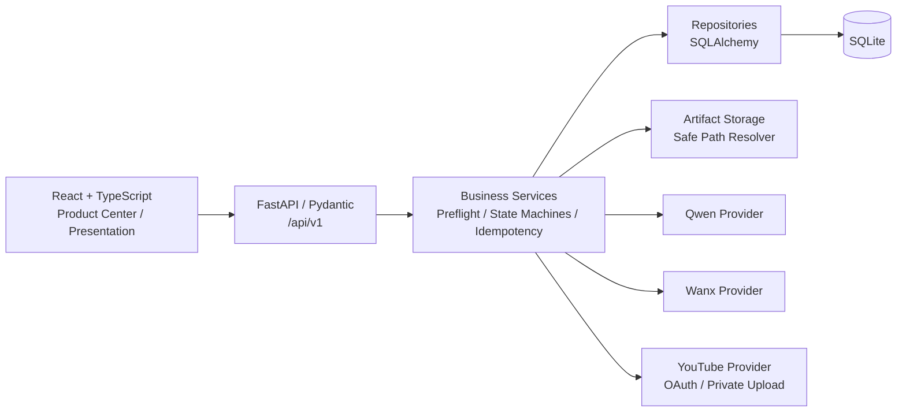
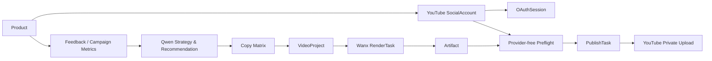
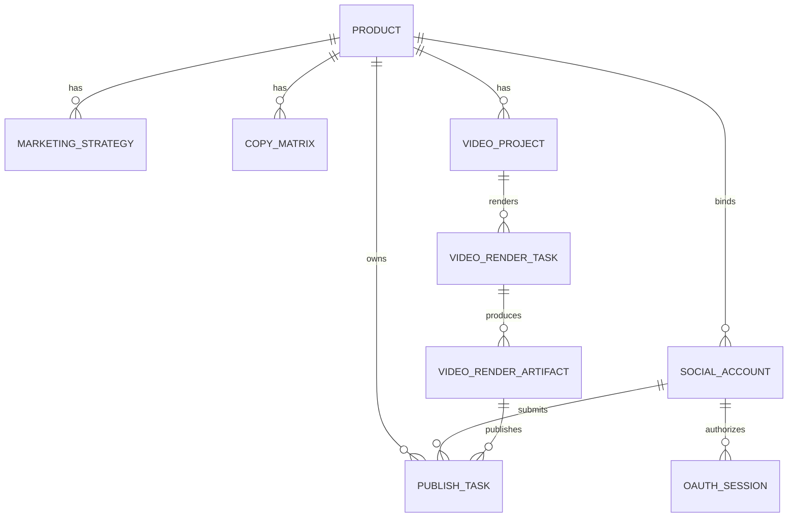

# SocialPilot AI 架构说明

## 架构速览

SocialPilot AI采用模块化单体：React前端与FastAPI后端通过版本化API通信，业务服务负责对象关系和状态机，Repository统一数据库访问，外部能力封装在Provider层。



Presentation Mode复用相同的只读API和安全Artifact解析器，不建立第二套展示数据层，也不注入外部Provider。

## 真实业务闭环



每一步都使用精确外键或显式身份，不用不明确的“latest对象”替代发布结果。比赛上传验收使用独立受控、哈希验证的 Wanx Artifact；V2-L1 Live 主链验收记录独立保留，二者不混同。

## 核心数据模型

| 模型 | 作用与约束 |
| --- | --- |
| `Product` | 商品根对象，关联策略、文案、视频、账号与发布任务。 |
| `MarketingStrategy` | Qwen结构化营销策略，保留Product来源。 |
| `CopyMatrix` | 保存平台差异化文案，并关联Product与Strategy。 |
| `VideoProject` | 结构化视频方案，关联Product、Strategy与Copy。 |
| `VideoRenderTask` | Wanx异步任务状态、分镜、幂等键和Provider身份。 |
| `VideoRenderArtifact` | 成功渲染结果的元数据与安全文件引用。 |
| `SocialAccount` | Product下的YouTube频道身份、连接状态和加密Token。 |
| `OAuthSession` | PKCE、state摘要、浏览器会话摘要、过期时间与一次性消费状态。 |
| `PublishTask` | 精确绑定Product、SocialAccount和Artifact，记录发布元数据、状态及Provider视频身份。 |
| `DemoScenario` | 明确引用演示对象，Presentation只读加载。 |

关系概要：



## Provider与状态机

### Qwen

业务服务构造受约束Prompt；Provider返回JSON文本；Pydantic校验通过后才允许持久化。指标由确定性代码计算，不交给模型重新计算。

### Wanx

`VideoRenderExecutionService`负责一次提交、显式状态查询和Artifact创建。创建本地RenderTask本身不调用Provider；真实执行由Feature Gate与用户操作保护。

### YouTube

YouTube Provider分为账号绑定与发布能力：

- OAuth使用Authorization Code + PKCE；state只保存摘要，并绑定浏览器会话摘要。
- OAuthSession有过期时间且只能消费一次，防止state重放。
- access token和refresh token通过Fernet加密后保存；密钥只从后端本机环境读取。
- Preflight只检查本地账号、Artifact、文件和元数据，不调用Provider、不创建PublishTask。
- 发布使用固定幂等键；快速重复请求复用同一PublishTask。
- 隐私固定为Private；made-for-kids必须由用户明确选择；AI合成内容披露开启；不通知订阅者。
- 上传前授权失败进入确定性`FAILED`；只有可能已发送内容但结果未知时才进入`SUBMIT_UNKNOWN`。
- `FAILED`与`SUBMIT_UNKNOWN`均不自动重传。
- 连接建立阶段只允许对连接失败进行一次有限重试；HTTP响应错误和媒体阶段不自动重试。

## Presentation隔离

Presentation Mode通过DemoScenario读取确定对象链：

```text
Product → MarketingStrategy → CopyMatrix → VideoProject
       → SUCCEEDED RenderTask → Artifact
```

- 页面显示 `0 AI Calls`。
- Artifact元数据和视频内容复用正式只读API与安全路径解析器。
- 社交发布区域完全隐藏。
- 不执行生成、Provider Refresh、OAuth、Preflight或上传。
- 不因页面访问或刷新写入数据库。

## API概览

所有地址均位于 `/api/v1`。

### Product、内容与视频

| 方法 | 路径 | 说明 |
| --- | --- | --- |
| `GET/POST` | `/products` | 查询或创建商品。 |
| `GET/PATCH` | `/products/{product_id}` | 查询或更新商品。 |
| `POST` | `/products/{product_id}/strategy` | 生成结构化Marketing Strategy。 |
| `POST` | `/products/{product_id}/copy` | 生成Copy Matrix。 |
| `POST` | `/products/{product_id}/video-projects` | 创建VideoProject。 |
| `POST` | `/video-projects/{video_project_id}/render-tasks` | 创建本地RenderTask。 |
| `POST` | `/video-render-tasks/{task_id}/submit` | 显式提交Wanx任务。 |
| `POST` | `/video-render-tasks/{task_id}/refresh` | 显式查询Wanx状态。 |
| `GET` | `/video-projects/{video_project_id}/render-artifacts` | 只读查询Artifact。 |
| `GET` | `/video-render-artifacts/{artifact_id}/content` | 安全读取Artifact媒体内容。 |
| `GET` | `/demo/snapshot` | 只读获取Presentation Snapshot。 |

### YouTube账号与发布

| 方法 | 路径 | 说明 |
| --- | --- | --- |
| `POST` | `/social-accounts/youtube/connect` | 创建一次性OAuth会话并返回授权入口。 |
| `GET` | `/social-accounts/youtube/callback` | 校验state、PKCE和浏览器会话，完成账号绑定。 |
| `GET` | `/social-accounts` | 查询Product下的本地账号记录。 |
| `GET` | `/social-accounts/{account_id}` | 查询精确账号。 |
| `POST` | `/social-accounts/{account_id}/disconnect` | 本地断开或用户明确撤销授权。 |
| `GET` | `/products/{product_id}/publishing/youtube/artifacts` | 查询可发布的精确Artifact候选。 |
| `POST` | `/products/{product_id}/publishing/youtube/preflight` | Provider-free发布前检查。 |
| `POST` | `/products/{product_id}/publishing/youtube` | 创建或复用PublishTask并执行一次Private上传。 |
| `GET` | `/products/{product_id}/publish-tasks` | 只读恢复本地发布历史。 |
| `GET` | `/publish-tasks/{task_id}` | 查询精确PublishTask。 |
| `POST` | `/publish-tasks/{task_id}/refresh` | 用户显式查询Provider状态；不会重新上传。 |

账号绑定Gate与发布Gate彼此独立；前端Gate只控制UI，后端Gate是安全边界。Presentation不会渲染这些操作入口。

## 配置边界

文档只列变量名，不保存值：

```text
DATABASE_URL
QWEN_API_KEY
WANX_API_KEY
GOOGLE_OAUTH_CLIENT_ID
GOOGLE_OAUTH_CLIENT_SECRET
GOOGLE_OAUTH_REDIRECT_URI
SOCIAL_TOKEN_ENCRYPTION_KEY
VIDEO_ARTIFACT_STORAGE_ROOT
ENABLE_SOCIAL_ACCOUNT_BINDING
ENABLE_YOUTUBE_PUBLISHING
YOUTUBE_REQUEST_TIMEOUT
VITE_API_BASE_URL
VITE_ENABLE_SOCIAL_ACCOUNT_BINDING
VITE_ENABLE_YOUTUBE_PUBLISHING
```

真实值只能存在于被忽略的本机环境文件、进程环境或安全密钥服务中。测试和Fake Browser Smoke从代码层禁止加载本机环境文件。

## 当前边界

- Instagram和TikTok发布尚未实现。
- 自动广告投放、预算修改和广告平台执行尚未实现。
- Presentation Snapshot不代表实时AI生成或真实广告归因。
- 系统不会自动重试不确定上传，也不会自动发布。
