# SocialPilot AI Development Roadmap

> Evidence baseline: repository history, tracked documentation, tests, and the V2 handoff. A stage without an independent Git checkpoint is explicitly marked; no commit or test result is inferred.

## Status

- ✅ Completed
- 🟡 In progress
- ⏳ Pending
- ⛔ Blocked
- ⚠️ Not entering now

## Development tree

```mermaid
flowchart TB
    ROOT["SocialPilot AI"]
    ROOT --> HIST["C0-C5 historical capabilities"]
    ROOT --> FREEZE["Submission Freeze<br/>competition-freeze-v1 @ 9877216"]
    ROOT --> V2["Competition Product V2<br/>competition-product-v2 @ 9877216"]
    HIST --> C0["✅ C0 Foundation"]
    HIST --> C1["✅ C1 Business chain"]
    HIST --> C2["✅ C2 Qwen and content generation"]
    HIST --> C3["✅ C3 Wanx render pipeline"]
    HIST --> C4["⚠️ C4 Performance-to-Prompt gap"]
    HIST --> C5["✅ C5 Competition demo and freeze"]
    C3 --> C3A["✅ C3-A Render artifact infrastructure"]
    C3 --> C3B["✅ C3-B Wanx provider adapter"]
    C3 --> C3C["✅ C3-C Execution pipeline"]
    C3 --> C3D["✅ C3-D Real pipeline verification"]
    C3 --> C3E["✅ C3-E Verified output and live facade"]
    FREEZE --> S0["✅ S0 Quality baseline"]
    FREEZE --> S1["✅ S1 Evidence and demo asset"]
    FREEZE --> S2["✅ S2 Submission documentation"]
    FREEZE --> S3["⚠️ S3 External submission package"]
    FREEZE --> SFINAL["✅ S-FINAL Repository freeze"]
    V2 --> V2C0["✅ V2-C0 Branch and roadmap baseline"]
    V2 --> V2C1["✅ V2-C1 Operable workspace"]
    V2 --> V2C2["⏳ V2-C2 Operable Qwen content chain"]
    V2 --> V2C3["⏳ V2-C3 Wanx task hardening"]
    V2 --> V2C4["⏳ V2-C4 Performance-to-Prompt"]
    V2 --> V2C5["⏳ V2-C5 Project and history"]
    V2 --> V2C6["⏳ V2-C6 Deployment and stability"]
    V2C1 --> V2C11A["✅ V2-C1.1A Product form and validation"]
    V2C1 --> V2C11B["✅ V2-C1.1B Product list and detail"]
    V2C1 --> V2C12A["✅ V2-C1.2A Market and platform selection"]
    V2C1 --> V2C12B["✅ V2-C1.2B Task start entry"]
    V2C2 --> V2C21A["✅ V2-C2.1A Strategy operation entry"]
    V2C2 --> V2C21B["✅ V2-C2.1B State failure and result UI"]
    V2C2 --> V2C21C["✅ V2-C2.1C MarketingBrief-aware contract"]
    V2C21C --> V2C21D["⏳ Controlled real Qwen verification"]
    V2C21D --> V2C21E["⏳ Real Strategy result acceptance"]
    V2C21E --> V2C22A["⏳ V2-C2.2A Copy Matrix operation entry"]
    V2C2 --> V2C22B["⏳ V2-C2.2B Save and history"]
    V2C3 --> V2C31A["⏳ V2-C3.1A VideoProject to RenderTask"]
    V2C3 --> V2C31B["⏳ V2-C3.1B Status and polling UI"]
    V2C3 --> V2C32A["⏳ V2-C3.2A Stable asset display and download"]
    V2C3 --> V2C32B["⏳ V2-C3.2B Recovery and fallback"]
    V2C4 --> V2C41A["⏳ V2-C4.1A FeedbackContext"]
    V2C4 --> V2C41B["⏳ V2-C4.1B Recommendation constraints"]
    V2C4 --> V2C42A["⏳ V2-C4.2A Generate V2 Copy"]
    V2C4 --> V2C42B["⏳ V2-C4.2B Generate V2 VideoProject"]
    V2C4 --> V2C43A["⏳ V2-C4.3A Parent-child versions"]
    V2C4 --> V2C43B["⏳ V2-C4.3B Version comparison"]
    V2C5 --> V2C51A["⏳ V2-C5.1A Generation history"]
    V2C5 --> V2C51B["⏳ V2-C5.1B Result replay"]
    V2C5 --> V2C52A["⏳ V2-C5.2A Error and retry records"]
    V2C6 --> V2C61A["⏳ V2-C6.1A Environment and deployment"]
    V2C6 --> V2C61B["⏳ V2-C6.1B Security and rate limits"]
    V2C6 --> V2C62A["⏳ V2-C6.2A Minimal real-model smoke"]
    V2C6 --> V2C62B["⏳ V2-C6.2B Presentation regression"]
```

## Historical node ledger

| Node | Status | Date | Commit or tag | Preserved test evidence | Prerequisite | Known issue | Next |
|---|---|---:|---|---|---|---|---|
| C0 Foundation | ✅ | 2026-07-17 | `61dd14e` contains the reconstructed foundation; no earlier standalone commit | Stable-baseline code/tests exist; no independent C0 result is preserved | None | Early history is squashed into the first commit | C1 |
| C1 Business chain | ✅ | 2026-07-17 | `61dd14e` | Product, strategy, copy, campaign, metrics, video-plan, API and UI tests are tracked; no independent total is preserved | C0 | Some presentation paths use preset data | C2 |
| C2 Qwen/content | ✅ | 2026-07-17 | `61dd14e`; verification `57df1d1` | Qwen report records one real smoke: 1 passed; normal tests skip it | C1 | Real calls remain opt-in and cost-bearing | C3 |
| C3-A Artifact infrastructure | ✅ | 2026-07-17 | `9e3a740` | Artifact tests added; stage run count not preserved | C2 VideoProject | Provider URL is not durable storage | C3-B |
| C3-B Wanx adapter | ✅ | 2026-07-17 | `25f17d8` | Provider mock tests added; stage count not preserved | C3-A | External network/region risk | C3-C |
| C3-C Execution pipeline | ✅ | 2026-07-17 | `027eccb` | Execution service/API tests added; stage count not preserved | C3-B | Requires asynchronous polling | C3-D |
| C3-D Real verification | ✅ | 2026-07-19 | `5f0a5f9` | Opt-in real smoke and successful task-to-Artifact evidence | C3-C and approved credentials/cost | Historical provider reliability risk | C3-E |
| C3-E Verified output/live facade | ✅ | 2026-07-19 | `9e23124` | Live API and Artifact display tests added | C3-D | Facade default-off; output may expire | C4/C5 |
| C4 Performance-to-Prompt | ⚠️ | — | No implementation commit | Not implemented; no tests | Growth/version contract design | No automatic V2 content or parent-child versions | V2-C4 |
| C5 Demo and freeze | ✅ | 2026-07-21 | `9877216`; `competition-freeze-v1` | 84 passed, 2 skipped, Ruff and frontend build passed | C0-C3 | Demo mode is not a full operable workspace | V2 |

## Submission reconstruction

The labels below reconstruct submission work from tracked evidence. Only S0, S2, and the final freeze are explicitly named or directly evidenced in tracked documentation; rows without a standalone checkpoint are not presented as independent commits.

| Node | Status | Date | Commit or tag | Result | Prerequisite | Known issue | Next |
|---|---|---:|---|---|---|---|---|
| S0 Quality baseline | ✅ | 2026-07-21 | Included in `9877216`; no dedicated commit | 84 passed, 2 skipped, 1 warning; Ruff/build passed | C5 | Known Starlette warning | S1 |
| S1 Evidence/demo asset | ✅ | 2026-07-19–21 | `9e23124`, `9877216` | Verified local portrait MP4 documented and tracked | Successful C3 Artifact | Online Artifact URL can expire | S2 |
| S2 Submission docs | ✅ | 2026-07-21 | `9877216`; no separate S2 checkpoint | Capability boundaries and submission docs preserved | S0/S1 | Some checklist statements predate freeze | S3 |
| S3 External package | ⚠️ | 2026-07-21 | Not tracked by design | Handoff records PDF/video/ZIP QA | S2 | Competition form not formally submitted at handoff | S-FINAL |
| S-FINAL Freeze | ✅ | 2026-07-21 | `competition-freeze-v1` → `9877216` | Freeze gate passed | S0-S3 review | Tag/history immutable | V2-C0 |

## Competition Product V2 ledger

| Node | Status | Date | Commit or tag | Test result | Prerequisite | Known issue | Next |
|---|---|---:|---|---|---|---|---|
| V2-C0 | ✅ | 2026-07-21 | Start: `competition-freeze-v1` at `98772160208840eff2f00b97b78ae34809b1786f`; V2-C0 checkpoint: see this Git commit | Backend: 84 passed, 2 deselected, 0 failed, 1 warning; Ruff passed; TypeScript passed; Vite production build passed, 118 modules | Freeze verified | None within V2-C0 scope | V2-C1.1A Product creation form and validation only |
| V2-C1 | ✅ | 2026-07-22 | V2-C1.1A through V2-C1.2B checkpoints/development tree | MarketingBrief: 7 passed; Product: 13 passed; full pytest: 94 passed, 2 skipped, 0 failed, 1 warning; Ruff passed; TypeScript passed; Vite production build passed (121 modules); isolated browser/API/SQLite smoke passed | V2-C0 accepted | Task input stores a single latest-readable MarketingBrief per Product in this UI; no full history center or AI generation in V2-C1 | V2-C2 Operable Qwen content chain |
| V2-C2 | ⏳ | — | None | Not run | V2-C1 | Real Qwen needs cost approval | V2-C3 |
| V2-C3 | ⏳ | — | None | Not run | V2-C1/existing C3 | Temporary asset URLs | V2-C4 |
| V2-C4 | ⏳ | — | None | Not run | V2-C1–C3 | Feedback/version contracts absent | V2-C5 |
| V2-C5 | ⏳ | — | None | Not run | V2-C4 | Retry/history semantics pending | V2-C6 |
| V2-C6 | ⏳ | — | None | Not run | V2-C1–C5 | Deployment/rate-limit/smoke pending | Release review |

### V2-C1.1A completion record

| Status | Date | Modules | API reuse | Verified result | AI/provider calls | Next |
|---|---:|---|---|---|---|---|
| ✅ Completed | 2026-07-22 | Product create schema/tests; workspace form, API typing/error handling, route guard, and styles | Existing `POST /api/v1/products` with HTTP 201 and existing repository/service persistence | Product tests: 13 passed; full pytest: 89 passed, 2 skipped, 0 failed, 1 warning; Ruff passed; TypeScript passed; Vite production build passed (119 modules); isolated browser/API/SQLite smoke passed | None; no Qwen, Wanx, VideoProject, RenderTask, or Artifact created | V2-C1.1B Product list and detail |

### V2-C1.1B completion record

| Status | Date | Modules | API reuse | Verified result | Known limitation | Next |
|---|---:|---|---|---|---|---|
| ✅ Completed | 2026-07-22 | Real product list, independent detail view, create-to-refresh/select linkage, loading/empty/error/retry/selected states, stale-request protection, and responsive styles | Existing `GET /api/v1/products` and `GET /api/v1/products/{product_id}` with existing Product schema/repository/service; no Backend or database change | Product tests: 13 passed; full pytest: 89 passed, 2 skipped, 0 failed, 1 warning; Ruff passed; TypeScript passed; Vite production build passed (119 modules); isolated three-product browser/API/SQLite smoke and Presentation Mode regression passed | Product list API has no limit/offset, so this stage uses the complete response in a bounded scroll area; no frontend test framework was added | V2-C1.2A Target market and platform selection |

### V2-C1.2A completion record

| Status | Date | Modules | Market persistence | Platform boundary | Verified result | Known limitation | Next |
|---|---:|---|---|---|---|---|---|
| ✅ Completed | 2026-07-22 | Product update client/type, per-product marketing-task configuration, readiness summary, save/error/retry states, race guards, and responsive styles | Existing `PATCH /api/v1/products/{product_id}` updates `Product.target_markets`; no Backend, ORM, table, or migration change | TikTok, Instagram, and Facebook are per-product frontend session drafts only; explicitly not persisted until a future task-start contract | Product tests: 13 passed; full pytest: 89 passed, 2 skipped, 0 failed, 1 warning; Ruff passed; TypeScript passed; Vite production build passed (120 modules); isolated browser/API/SQLite smoke passed | Platform drafts reset on a full page reload; historical unknown market values remain visible and preserved until explicit user removal/save | V2-C1.2B Task start entry |

### V2-C1.2B completion record

| Status | Date | Modules | MarketingBrief persistence and recovery | AI boundary | Verified result | Known limitation | Next |
|---|---:|---|---|---|---|---|---|
| ✅ Completed | 2026-07-22 | Existing MarketingBrief schema/repository/service/routes, focused API tests, typed frontend client, real task-start/recovery states, duplicate/race guards, and responsive result UI | Reused `POST /api/v1/marketing-tasks`; added `GET /api/v1/marketing-tasks/{task_id}` and `GET /api/v1/marketing-tasks/latest?product_id=...`; platforms persist on MarketingBrief, while a canonical target-market snapshot is stored within the existing geographic audience semantics and returned explicitly; no ORM/table/migration change | Save/read routes do not inject or call a Provider and create no MarketingStrategy, CopyMatrix, VideoProject, RenderTask, or Artifact | MarketingBrief tests: 7 passed; Product tests: 13 passed; full pytest: 94 passed, 2 skipped, 0 failed, 1 warning; Ruff passed; TypeScript passed; Vite production build passed (121 modules); isolated two-product browser/API/SQLite smoke, Backend-down recovery, console check, and Presentation Mode regression passed | Workspace restores only the latest Brief per Product; audience/language/tone/objective use current stage defaults and have no editing UI; V2-C2 generation remains pending | V2-C2 Operable Qwen content chain |

### V2-C2.1A completion record

| Status | Date | Modules | Read-only preflight contract | Provider and cost boundary | Verified result | Known limitation | Next |
|---|---:|---|---|---|---|---|---|
| ✅ Completed | 2026-07-23 | Strategy preflight schema/service/route/tests; pure Product-input preparation; typed frontend client; task-scoped preflight, consent, failure/retry, reset, and disabled execution UI | Added `GET /api/v1/marketing-tasks/{task_id}/strategy-preflight`; reads Product and the saved MarketingBrief snapshot, reports requirements and Provider configuration as a boolean, and creates no downstream record | The endpoint never resolves or instantiates a Provider. UI identifies Qwen/model and potential Credits cost; consent defaults false, is session-only, and never enables a generation handler in this stage | Related tests: 25 passed; full pytest: 99 passed, 2 skipped, 0 failed, 1 warning; Ruff passed; TypeScript passed; Vite production build passed (122 modules); isolated two-product UI/API/SQLite smoke, context reset, Backend-down error/retry, and zero-downstream-record checks passed | The existing real generation endpoint still consumes Product input only; MarketingBrief-to-prompt execution and all real Provider calls remain V2-C2.1B work. Final Presentation browser navigation was blocked by the browser security policy, so the unchanged route guard and `0 AI Calls` component were verified by source/type/build checks rather than a new browser assertion | V2-C2.1B State, failure, and result UI |

### V2-C2.1B completion record

| Status | Date | Modules | Result and recovery contract | Execution safety boundary | Verified result | Known limitation | Next |
|---|---:|---|---|---|---|---|---|
| ✅ Completed | 2026-07-24 | Latest-strategy read schema/service/route/tests; safe Provider quota mapping; typed frontend result/error client; feature flag; centralized preflight/execution states; result, failure, retry, and recovery UI | Added read-only `GET /api/v1/products/{product_id}/strategies/latest`; Product existence and empty state return clear 404s; latest is selected by creation time/ID, scoped to Product, creates nothing, and never resolves a Provider | `VITE_ENABLE_STRATEGY_EXECUTION` is false when absent. Preflight ready, safe Provider configuration, explicit cost consent, matching Product/Brief identity, feature flag, and a synchronous submission lock are all required and rechecked in the handler. The flag is a build gate, not authorization. Fake execution was enabled only against an injected offline Provider and temporary SQLite | Strategy-related tests: 42 passed; full pytest: 107 passed, 2 real-provider smoke tests skipped, 0 failed, 1 warning; Ruff passed; TypeScript passed; Vite production build passed (123 modules). Browser/Fake smoke covered default consent, submitting, double-click protection, success, reload recovery, authentication/quota/network/invalid-output errors, retry controls, stale Product switching, default-off execution, and Presentation redirect/navigation isolation | MarketingStrategy remains related to Product only and has no MarketingBrief foreign key; restored or uncertain results are therefore labeled as the Product's latest saved strategy. The current prompt still consumes Product fields only. No platform-advice field exists in the real Strategy schema, so none is invented. Real Qwen/cost verification and full history remain pending | V2-C2.1C MarketingBrief-aware Strategy Input and Execution Contract |

### V2-C2.1C completion record

| Status | Date | Input and API contract | Execution safety boundary | Verified result | Known limitation | Next |
|---|---:|---|---|---|---|---|
| ✅ Completed; checkpoint pending | 2026-07-25 | Added task-bound `POST /api/v1/marketing-tasks/{task_id}/strategy`; a single pure service-layer prompt builder now supplies Product name/category/description/selling points plus the requested MarketingBrief ID, immutable market snapshot, platforms, audience, language, tone, and objective. The old Product-only route remains compatible but is no longer used by the workspace | Backend `ENABLE_STRATEGY_EXECUTION` and frontend `VITE_ENABLE_STRATEGY_EXECUTION` both default false. Provider configuration and execution authorization are separate Preflight booleans; both public execution routes are blocked before Provider resolution when server execution is disabled | Focused MarketingBrief/Strategy/Product/Qwen tests: 80 passed; full pytest: 145 passed, 2 real-provider tests skipped, 0 failed, 1 warning; Ruff, TypeScript, and Vite production build passed (123 modules). Offline Fake Provider browser smoke verified task-bound success, one Strategy after rapid double click, recovery/source labels, Product/task isolation, safe network failure/retry, production-default disablement, and Presentation Mode with 0 console errors/warnings | MarketingStrategy still has no MarketingBrief foreign key. `source_task_id` and `association_persisted=false` are honest execution-response metadata only; reload can recover only the Product's latest Strategy and cannot prove Brief ownership | V2-C2.1C checkpoint, then controlled real Qwen verification, real Strategy result acceptance, and only then V2-C2.2A Copy Matrix |

Substage gates are in [V2 Plan](v2-plan.md). Execution records belong in [Progress Log](progress-log.md).
