# SocialPilot AI Development Roadmap

> Evidence baseline: repository history, tracked documentation, tests, and the V2 handoff. A stage without an independent Git checkpoint is explicitly marked; no commit or test result is inferred.

## Status

- ✅ Completed
- 🟡 In progress
- ⏳ Pending
- ⛔ Blocked
- ⚠️ Not entering now

## Development tree

```mermaid
flowchart TB
    ROOT["SocialPilot AI"]
    ROOT --> HIST["C0-C5 historical capabilities"]
    ROOT --> FREEZE["Submission Freeze<br/>competition-freeze-v1 @ 9877216"]
    ROOT --> V2["Competition Product V2<br/>competition-product-v2 @ 9877216"]
    HIST --> C0["✅ C0 Foundation"]
    HIST --> C1["✅ C1 Business chain"]
    HIST --> C2["✅ C2 Qwen and content generation"]
    HIST --> C3["✅ C3 Wanx render pipeline"]
    HIST --> C4["⚠️ C4 Performance-to-Prompt gap"]
    HIST --> C5["✅ C5 Competition demo and freeze"]
    C3 --> C3A["✅ C3-A Render artifact infrastructure"]
    C3 --> C3B["✅ C3-B Wanx provider adapter"]
    C3 --> C3C["✅ C3-C Execution pipeline"]
    C3 --> C3D["✅ C3-D Real pipeline verification"]
    C3 --> C3E["✅ C3-E Verified output and live facade"]
    FREEZE --> S0["✅ S0 Quality baseline"]
    FREEZE --> S1["✅ S1 Evidence and demo asset"]
    FREEZE --> S2["✅ S2 Submission documentation"]
    FREEZE --> S3["⚠️ S3 External submission package"]
    FREEZE --> SFINAL["✅ S-FINAL Repository freeze"]
    V2 --> V2C0["✅ V2-C0 Branch and roadmap baseline"]
    V2 --> V2C1["✅ V2-C1 Operable workspace"]
    V2 --> V2C2["✅ V2-C2 Operable Qwen content chain"]
    V2 --> V2C3["⏳ V2-C3 Wanx task hardening"]
    V2 --> V2C4["⏳ V2-C4 Performance-to-Prompt"]
    V2 --> V2C5["⏳ V2-C5 Project and history"]
    V2 --> V2C6["⏳ V2-C6 Deployment and stability"]
    V2C1 --> V2C11A["✅ V2-C1.1A Product form and validation"]
    V2C1 --> V2C11B["✅ V2-C1.1B Product list and detail"]
    V2C1 --> V2C12A["✅ V2-C1.2A Market and platform selection"]
    V2C1 --> V2C12B["✅ V2-C1.2B Task start entry"]
    V2C2 --> V2C21A["✅ V2-C2.1A Strategy operation entry"]
    V2C2 --> V2C21B["✅ V2-C2.1B State failure and result UI"]
    V2C2 --> V2C21C["✅ V2-C2.1C MarketingBrief-aware contract"]
    V2C21C --> V2C21D["✅ Controlled real Qwen verification"]
    V2C21D --> V2C22A["✅ V2-C2.2A Copy Matrix operation entry"]
    V2C22A --> V2C22B["✅ V2-C2.2B Exact-Strategy Copy save and recovery"]
    V2C22B --> V2C22C["✅ V2-C2.2C Real Copy Qwen Verification Evidence"]
    V2C22C --> V2C31A
    V2C3 --> V2C31A["✅ V2-C3.1A VideoProject to RenderTask operation entry"]
    V2C31A --> V2C31B
    V2C3 --> V2C31B["✅ V2-C3.1B Exact RenderTask execution, state and recovery"]
    V2C31B --> V2C31C["✅ V2-C3.1C Real Wanx Render Verification Evidence"]
    V2C31C --> V2C32A
    V2C3 --> V2C32A["✅ V2-C3.2A Stable asset display and download"]
    V2C3 --> V2C32B["✅ V2-C3.2B Recovery and fallback"]
    V2C32B --> V2C41A
    V2C4 --> V2C41A["✅ V2-C4.1A Structured FeedbackContext"]
    V2C4 --> V2C41B["✅ V2-C4.1B Recommendation constraints"]
    V2C4 --> V2C42A["⏳ V2-C4.2A Generate V2 Copy"]
    V2C4 --> V2C42B["⏳ V2-C4.2B Generate V2 VideoProject"]
    V2C4 --> V2C43A["⏳ V2-C4.3A Parent-child versions"]
    V2C4 --> V2C43B["⏳ V2-C4.3B Version comparison"]
    V2C5 --> V2C51A["⏳ V2-C5.1A Generation history"]
    V2C5 --> V2C51B["⏳ V2-C5.1B Result replay"]
    V2C5 --> V2C52A["⏳ V2-C5.2A Error and retry records"]
    V2C6 --> V2C61A["⏳ V2-C6.1A Environment and deployment"]
    V2C6 --> V2C61B["⏳ V2-C6.1B Security and rate limits"]
    V2C6 --> V2C62A["⏳ V2-C6.2A Minimal real-model smoke"]
    V2C6 --> V2C62B["⏳ V2-C6.2B Presentation regression"]
```

## Historical node ledger

| Node | Status | Date | Commit or tag | Preserved test evidence | Prerequisite | Known issue | Next |
|---|---|---:|---|---|---|---|---|
| C0 Foundation | ✅ | 2026-07-17 | `61dd14e` contains the reconstructed foundation; no earlier standalone commit | Stable-baseline code/tests exist; no independent C0 result is preserved | None | Early history is squashed into the first commit | C1 |
| C1 Business chain | ✅ | 2026-07-17 | `61dd14e` | Product, strategy, copy, campaign, metrics, video-plan, API and UI tests are tracked; no independent total is preserved | C0 | Some presentation paths use preset data | C2 |
| C2 Qwen/content | ✅ | 2026-07-17 | `61dd14e`; verification `57df1d1` | Qwen report records one real smoke: 1 passed; normal tests skip it | C1 | Real calls remain opt-in and cost-bearing | C3 |
| C3-A Artifact infrastructure | ✅ | 2026-07-17 | `9e3a740` | Artifact tests added; stage run count not preserved | C2 VideoProject | Provider URL is not durable storage | C3-B |
| C3-B Wanx adapter | ✅ | 2026-07-17 | `25f17d8` | Provider mock tests added; stage count not preserved | C3-A | External network/region risk | C3-C |
| C3-C Execution pipeline | ✅ | 2026-07-17 | `027eccb` | Execution service/API tests added; stage count not preserved | C3-B | Requires asynchronous polling | C3-D |
| C3-D Real verification | ✅ | 2026-07-19 | `5f0a5f9` | Opt-in real smoke and successful task-to-Artifact evidence | C3-C and approved credentials/cost | Historical provider reliability risk | C3-E |
| C3-E Verified output/live facade | ✅ | 2026-07-19 | `9e23124` | Live API and Artifact display tests added | C3-D | Facade default-off; output may expire | C4/C5 |
| C4 Performance-to-Prompt | ⚠️ | — | No implementation commit | Not implemented; no tests | Growth/version contract design | No automatic V2 content or parent-child versions | V2-C4 |
| C5 Demo and freeze | ✅ | 2026-07-21 | `9877216`; `competition-freeze-v1` | 84 passed, 2 skipped, Ruff and frontend build passed | C0-C3 | Demo mode is not a full operable workspace | V2 |

## Submission reconstruction

The labels below reconstruct submission work from tracked evidence. Only S0, S2, and the final freeze are explicitly named or directly evidenced in tracked documentation; rows without a standalone checkpoint are not presented as independent commits.

| Node | Status | Date | Commit or tag | Result | Prerequisite | Known issue | Next |
|---|---|---:|---|---|---|---|---|
| S0 Quality baseline | ✅ | 2026-07-21 | Included in `9877216`; no dedicated commit | 84 passed, 2 skipped, 1 warning; Ruff/build passed | C5 | Known Starlette warning | S1 |
| S1 Evidence/demo asset | ✅ | 2026-07-19–21 | `9e23124`, `9877216` | Verified local portrait MP4 documented and tracked | Successful C3 Artifact | Online Artifact URL can expire | S2 |
| S2 Submission docs | ✅ | 2026-07-21 | `9877216`; no separate S2 checkpoint | Capability boundaries and submission docs preserved | S0/S1 | Some checklist statements predate freeze | S3 |
| S3 External package | ⚠️ | 2026-07-21 | Not tracked by design | Handoff records PDF/video/ZIP QA | S2 | Competition form not formally submitted at handoff | S-FINAL |
| S-FINAL Freeze | ✅ | 2026-07-21 | `competition-freeze-v1` → `9877216` | Freeze gate passed | S0-S3 review | Tag/history immutable | V2-C0 |

## Competition Product V2 ledger

| Node | Status | Date | Commit or tag | Test result | Prerequisite | Known issue | Next |
|---|---|---:|---|---|---|---|---|
| V2-C0 | ✅ | 2026-07-21 | Start: `competition-freeze-v1` at `98772160208840eff2f00b97b78ae34809b1786f`; V2-C0 checkpoint: see this Git commit | Backend: 84 passed, 2 deselected, 0 failed, 1 warning; Ruff passed; TypeScript passed; Vite production build passed, 118 modules | Freeze verified | None within V2-C0 scope | V2-C1.1A Product creation form and validation only |
| V2-C1 | ✅ | 2026-07-22 | V2-C1.1A through V2-C1.2B checkpoints/development tree | MarketingBrief: 7 passed; Product: 13 passed; full pytest: 94 passed, 2 skipped, 0 failed, 1 warning; Ruff passed; TypeScript passed; Vite production build passed (121 modules); isolated browser/API/SQLite smoke passed | V2-C0 accepted | Task input stores a single latest-readable MarketingBrief per Product in this UI; no full history center or AI generation in V2-C1 | V2-C2 Operable Qwen content chain |
| V2-C2 | ⏳ | — | None | Not run | V2-C1 | Real Qwen needs cost approval | V2-C3 |
| V2-C3 | ⏳ | — | None | Not run | V2-C1/existing C3 | Temporary asset URLs | V2-C4 |
| V2-C4 | ⏳ | — | None | Not run | V2-C1–C3 | Feedback/version contracts absent | V2-C5 |
| V2-C5 | ⏳ | — | None | Not run | V2-C4 | Retry/history semantics pending | V2-C6 |
| V2-C6 | ⏳ | — | None | Not run | V2-C1–C5 | Deployment/rate-limit/smoke pending | Release review |

### V2-C1.1A completion record

| Status | Date | Modules | API reuse | Verified result | AI/provider calls | Next |
|---|---:|---|---|---|---|---|
| ✅ Completed | 2026-07-22 | Product create schema/tests; workspace form, API typing/error handling, route guard, and styles | Existing `POST /api/v1/products` with HTTP 201 and existing repository/service persistence | Product tests: 13 passed; full pytest: 89 passed, 2 skipped, 0 failed, 1 warning; Ruff passed; TypeScript passed; Vite production build passed (119 modules); isolated browser/API/SQLite smoke passed | None; no Qwen, Wanx, VideoProject, RenderTask, or Artifact created | V2-C1.1B Product list and detail |

### V2-C1.1B completion record

| Status | Date | Modules | API reuse | Verified result | Known limitation | Next |
|---|---:|---|---|---|---|---|
| ✅ Completed | 2026-07-22 | Real product list, independent detail view, create-to-refresh/select linkage, loading/empty/error/retry/selected states, stale-request protection, and responsive styles | Existing `GET /api/v1/products` and `GET /api/v1/products/{product_id}` with existing Product schema/repository/service; no Backend or database change | Product tests: 13 passed; full pytest: 89 passed, 2 skipped, 0 failed, 1 warning; Ruff passed; TypeScript passed; Vite production build passed (119 modules); isolated three-product browser/API/SQLite smoke and Presentation Mode regression passed | Product list API has no limit/offset, so this stage uses the complete response in a bounded scroll area; no frontend test framework was added | V2-C1.2A Target market and platform selection |

### V2-C1.2A completion record

| Status | Date | Modules | Market persistence | Platform boundary | Verified result | Known limitation | Next |
|---|---:|---|---|---|---|---|---|
| ✅ Completed | 2026-07-22 | Product update client/type, per-product marketing-task configuration, readiness summary, save/error/retry states, race guards, and responsive styles | Existing `PATCH /api/v1/products/{product_id}` updates `Product.target_markets`; no Backend, ORM, table, or migration change | TikTok, Instagram, and Facebook are per-product frontend session drafts only; explicitly not persisted until a future task-start contract | Product tests: 13 passed; full pytest: 89 passed, 2 skipped, 0 failed, 1 warning; Ruff passed; TypeScript passed; Vite production build passed (120 modules); isolated browser/API/SQLite smoke passed | Platform drafts reset on a full page reload; historical unknown market values remain visible and preserved until explicit user removal/save | V2-C1.2B Task start entry |

### V2-C1.2B completion record

| Status | Date | Modules | MarketingBrief persistence and recovery | AI boundary | Verified result | Known limitation | Next |
|---|---:|---|---|---|---|---|---|
| ✅ Completed | 2026-07-22 | Existing MarketingBrief schema/repository/service/routes, focused API tests, typed frontend client, real task-start/recovery states, duplicate/race guards, and responsive result UI | Reused `POST /api/v1/marketing-tasks`; added `GET /api/v1/marketing-tasks/{task_id}` and `GET /api/v1/marketing-tasks/latest?product_id=...`; platforms persist on MarketingBrief, while a canonical target-market snapshot is stored within the existing geographic audience semantics and returned explicitly; no ORM/table/migration change | Save/read routes do not inject or call a Provider and create no MarketingStrategy, CopyMatrix, VideoProject, RenderTask, or Artifact | MarketingBrief tests: 7 passed; Product tests: 13 passed; full pytest: 94 passed, 2 skipped, 0 failed, 1 warning; Ruff passed; TypeScript passed; Vite production build passed (121 modules); isolated two-product browser/API/SQLite smoke, Backend-down recovery, console check, and Presentation Mode regression passed | Workspace restores only the latest Brief per Product; audience/language/tone/objective use current stage defaults and have no editing UI; V2-C2 generation remains pending | V2-C2 Operable Qwen content chain |

### V2-C2.1A completion record

| Status | Date | Modules | Read-only preflight contract | Provider and cost boundary | Verified result | Known limitation | Next |
|---|---:|---|---|---|---|---|---|
| ✅ Completed | 2026-07-23 | Strategy preflight schema/service/route/tests; pure Product-input preparation; typed frontend client; task-scoped preflight, consent, failure/retry, reset, and disabled execution UI | Added `GET /api/v1/marketing-tasks/{task_id}/strategy-preflight`; reads Product and the saved MarketingBrief snapshot, reports requirements and Provider configuration as a boolean, and creates no downstream record | The endpoint never resolves or instantiates a Provider. UI identifies Qwen/model and potential Credits cost; consent defaults false, is session-only, and never enables a generation handler in this stage | Related tests: 25 passed; full pytest: 99 passed, 2 skipped, 0 failed, 1 warning; Ruff passed; TypeScript passed; Vite production build passed (122 modules); isolated two-product UI/API/SQLite smoke, context reset, Backend-down error/retry, and zero-downstream-record checks passed | The existing real generation endpoint still consumes Product input only; MarketingBrief-to-prompt execution and all real Provider calls remain V2-C2.1B work. Final Presentation browser navigation was blocked by the browser security policy, so the unchanged route guard and `0 AI Calls` component were verified by source/type/build checks rather than a new browser assertion | V2-C2.1B State, failure, and result UI |

### V2-C2.1B completion record

| Status | Date | Modules | Result and recovery contract | Execution safety boundary | Verified result | Known limitation | Next |
|---|---:|---|---|---|---|---|---|
| ✅ Completed | 2026-07-24 | Latest-strategy read schema/service/route/tests; safe Provider quota mapping; typed frontend result/error client; feature flag; centralized preflight/execution states; result, failure, retry, and recovery UI | Added read-only `GET /api/v1/products/{product_id}/strategies/latest`; Product existence and empty state return clear 404s; latest is selected by creation time/ID, scoped to Product, creates nothing, and never resolves a Provider | `VITE_ENABLE_STRATEGY_EXECUTION` is false when absent. Preflight ready, safe Provider configuration, explicit cost consent, matching Product/Brief identity, feature flag, and a synchronous submission lock are all required and rechecked in the handler. The flag is a build gate, not authorization. Fake execution was enabled only against an injected offline Provider and temporary SQLite | Strategy-related tests: 42 passed; full pytest: 107 passed, 2 real-provider smoke tests skipped, 0 failed, 1 warning; Ruff passed; TypeScript passed; Vite production build passed (123 modules). Browser/Fake smoke covered default consent, submitting, double-click protection, success, reload recovery, authentication/quota/network/invalid-output errors, retry controls, stale Product switching, default-off execution, and Presentation redirect/navigation isolation | MarketingStrategy remains related to Product only and has no MarketingBrief foreign key; restored or uncertain results are therefore labeled as the Product's latest saved strategy. The current prompt still consumes Product fields only. No platform-advice field exists in the real Strategy schema, so none is invented. Real Qwen/cost verification and full history remain pending | V2-C2.1C MarketingBrief-aware Strategy Input and Execution Contract |

### V2-C2.1C completion record

| Status | Date | Input and API contract | Execution safety boundary | Verified result | Known limitation | Next |
|---|---:|---|---|---|---|---|
| ✅ Completed | 2026-07-25 | Added task-bound `POST /api/v1/marketing-tasks/{task_id}/strategy`; a single pure service-layer prompt builder now supplies Product name/category/description/selling points plus the requested MarketingBrief ID, immutable market snapshot, platforms, audience, language, tone, and objective. The old Product-only route remains compatible but is no longer used by the workspace | Backend `ENABLE_STRATEGY_EXECUTION` and frontend `VITE_ENABLE_STRATEGY_EXECUTION` both default false. Provider configuration and execution authorization are separate Preflight booleans; both public execution routes are blocked before Provider resolution when server execution is disabled | Focused MarketingBrief/Strategy/Product/Qwen tests: 80 passed; full pytest: 145 passed, 2 real-provider tests skipped, 0 failed, 1 warning; Ruff, TypeScript, and Vite production build passed (123 modules). Offline Fake Provider browser smoke verified task-bound success, one Strategy after rapid double click, recovery/source labels, Product/task isolation, safe network failure/retry, production-default disablement, and Presentation Mode with 0 console errors/warnings | MarketingStrategy still has no MarketingBrief foreign key. `source_task_id` and `association_persisted=false` are honest execution-response metadata only; reload can recover only the Product's latest Strategy and cannot prove Brief ownership | Controlled real Qwen verification |

### V2-C2.1D controlled real Qwen verification record

| Status | Date | Contract commit | Controlled execution | Verified result | Association boundary | Next |
|---|---:|---|---|---|---|---|
| ✅ Completed | 2026-07-26 | `dc0b04eb45dc02f6350eee45d983becd37ff90b2` | One separately authorized task-bound `qwen-plus` call against isolated temporary SQLite; one actual Provider call; zero automatic retries | HTTP 200; MarketingBrief-aware inputs reached the Prompt; execution response and MarketingStrategy schema passed; 1 Strategy and 0 CopyMatrix/VideoProject/VideoRenderTask/VideoRenderArtifact records; temporary environment cleanup passed | MarketingStrategy still persists only `product_id`. Brief association is execution-response metadata and reload can recover only the Product's latest Strategy, not prove ownership by a specific Brief | V2-C2.2A Copy Matrix operation entry |

### V2-C2.2A Copy Matrix operation entry completion record

| Status | Date | Exact preflight contract | Execution safety boundary | Verified result | Known limitation | Next |
|---|---:|---|---|---|---|---|
| ✅ Completed; checkpoint `5292f96` | 2026-07-26 | Added read-only `GET /api/v1/marketing-tasks/{task_id}/strategies/{strategy_id}/copy-preflight`; it reads the exact URL Brief and Strategy, validates their shared Product, Product/Strategy content, the Brief market prefix and supported platform snapshot, and reports safe Provider/execution booleans | Backend `ENABLE_COPY_EXECUTION` and frontend `VITE_ENABLE_COPY_EXECUTION` independently default false. The compatible Product-only Copy POST now stops before Provider resolution when disabled, and the service repeats the gate. The workspace generation button is always disabled and has no handler | Copy/Strategy/Marketing/Product focused tests: 89 passed; full pytest: 153 passed, 2 real-provider tests skipped, 1 warning; Ruff, TypeScript, and Vite production build passed (124 modules). Isolated two-Product browser/API/SQLite smoke and Presentation Copy Matrix regression passed with 0 console errors/warnings, 0 Provider calls, 0 execution POSTs, and 0 CopyMatrix/downstream records | `contract_ready=false`: the old executor still selects the Product's latest Strategy, ignores the requested MarketingBrief platforms, and requires TikTok/Instagram/Facebook together. CopyMatrix persists `product_id` and `marketing_strategy_id`, but no MarketingBrief ID; there is no ordinary-workspace Copy read API | V2-C2.2B Brief-aware exact-Strategy Copy execution, save, and recovery contract |

### V2-C2.2B Brief-aware exact-Strategy Copy completion record

| Status | Date | Task-bound execution and recovery | Platform and association contract | Verified result | Known limitation | Next |
|---|---:|---|---|---|---|---|
| ✅ Completed; checkpoint `88429d7` | 2026-07-27 | Added `POST /api/v1/marketing-tasks/{task_id}/strategies/{strategy_id}/copy` and read-only `GET /api/v1/strategies/{strategy_id}/copy/latest`. Execution uses only the exact URL Brief and Strategy, runs Preflight, builds one structured untrusted-data Prompt, validates Provider output, saves CopyMatrix, and returns source metadata | Platforms are normalized and must exactly equal the immutable Brief snapshot, with 1–3 supported unique platforms and strict trimmed content validation. `marketing_strategy_id` persists the exact Strategy; MarketingBrief remains response-only because no Brief foreign key was added. Backend and frontend Copy switches still default false | Copy contract tests: 34 passed; Copy/Strategy/Marketing/Product regression: 109 passed; full pytest: 173 passed, 2 real-provider tests skipped, 1 warning; Ruff, TypeScript, and Vite build passed (124 modules). Isolated Fake Provider browser smoke saved one TikTok matrix and one TikTok+Instagram matrix, rejected invalid/uncertain outputs without writes, restored by exact Strategy, and completed Presentation regression with 0 console errors/warnings | Reload can prove only the persisted Strategy association and therefore labels the result “该策略最新Copy Matrix”; it cannot prove ownership by the current MarketingBrief. Real Provider evidence is recorded separately in V2-C2.2C | V2-C2.2C Real Copy Qwen Verification Evidence |

### V2-C2.2C Real Copy Qwen Verification Evidence

| Status | Date | Contract commit | Controlled execution | Verified result | Association boundary | Next |
|---|---:|---|---|---|---|---|
| ✅ Completed | 2026-07-27 | `88429d7` | One separately authorized task-bound `qwen-plus` Copy call; one Provider call, one execution POST, zero SDK retries, and zero outer retries | HTTP 200; exact US/TikTok Brief snapshot and exact Strategy inputs passed boolean Prompt checks; one TikTok-only CopyMatrix was written to isolated temporary SQLite; Wanx, VideoProject, VideoRenderTask, and VideoRenderArtifact remained 0; cleanup passed | CopyMatrix persists Product and Strategy IDs but has no MarketingBrief foreign key. The authorization is exhausted, and no further real AI call is permitted without new explicit authorization | V2-C3.1A VideoProject to RenderTask Operation Entry |

### V2-C3.1A VideoProject to RenderTask operation entry

| Status | Date | Read and Preflight contract | Execution safety boundary | Verified result | Known limitation | Next |
|---|---:|---|---|---|---|---|
| ✅ Completed; checkpoint pending | 2026-07-27 | Added exact `GET /api/v1/video-projects/{video_project_id}`, deterministic Product-scoped `GET /api/v1/products/{product_id}/video-projects/latest`, and read-only `GET /api/v1/video-projects/{video_project_id}/render-preflight`. Preflight validates the exact persisted Product, MarketingStrategy, CopyMatrix, VideoProject fields, scene schema, and timeline without building or returning a Provider Prompt | Added independent Backend `ENABLE_VIDEO_RENDER_EXECUTION` and frontend `VITE_ENABLE_VIDEO_RENDER_EXECUTION`, both default false. Ordinary submit/refresh routes now gate before Provider resolution and the execution service repeats the gate. The workspace button is natively disabled with no submit handler. Existing fixed live-demo behavior remains isolated behind its separate flag | Video/Render/Wanx tests: 51 passed; Product/Marketing/Strategy/Copy/Video regression: 160 passed; full pytest: 184 passed, 2 real-provider smoke tests skipped, 1 warning; Ruff, TypeScript, and Vite production build passed (125 modules). Isolated two-Product browser smoke verified A/B project isolation, Backend-down recovery, double-click protection, console 0/0, submit/refresh 0, and 0 RenderTask/Artifact writes. Presentation redirect, Demo Snapshot/0 AI Calls labels, four-stage navigation, and workspace isolation passed | `contract_ready=false`: the exact one-action RenderTask/submit contract, uncertain-submit recovery, and durable artifact storage are not implemented. VideoProject persists Product, MarketingStrategy, and CopyMatrix IDs but no MarketingBrief ID. The legacy local task-create API remains separate and is not called by the new workspace | V2-C3.1B Exact VideoProject RenderTask Execution, State and Recovery Contract |

### V2-C3.1B Exact VideoProject RenderTask execution, state and recovery

| Status | Date | Execution and recovery contract | Safety and persistence boundary | Verified result | Known limitation | Next |
|---|---:|---|---|---|---|---|
| ✅ Completed; checkpoint `7257c18` | 2026-07-27 | Added exact `POST /api/v1/video-projects/{video_project_id}/render-execution`, deterministic `GET /api/v1/video-projects/{video_project_id}/render-tasks/latest`, safe exact `GET /api/v1/video-render-tasks/{task_id}/recovery`, explicit refresh, and stable Artifact metadata/content APIs. A SHA-256 idempotency key covers the exact project, Scene 1 inputs, provider/model, duration, aspect ratio, resolution, and contract version. Replays reuse the same task and never resubmit terminal or uncertain work | Route and service gates remain default false. The state machine adds `SUBMITTING`, `SUBMIT_UNKNOWN`, `REFRESHING`, and `ARTIFACT_PERSIST_FAILED`; uncertain submit is never retried automatically. Successful Fake output is validated, bounded, atomically written beneath a configurable server storage root, and exposed without absolute paths or Provider URLs. `contract_ready=true`, while default `execution_enabled=false` keeps `ready_for_execution=false` | Existing Video subset: 39 passed; new contract: 36 passed; complete Video/Render/Artifact/Wanx/live: 66 passed, 1 warning; related regression: 176 passed, 1 skipped, 25 deselected, 1 warning; full pytest: 200 passed, 2 skipped, 1 known warning. Ruff, TypeScript, and Vite production build passed (125 modules). Browser Fake Wanx Smoke created 4 tasks with terminal states `SUCCEEDED`, `SUBMIT_UNKNOWN`, `FAILED`, and `ARTIFACT_PERSIST_FAILED`; exactly 1 Artifact was stored. Fake submit 4, refresh 3, output fetch 2. Double-click locks, reload recovery, Backend-down error, default-off zero-write behavior, Presentation redirect/navigation/isolation, and console 0/0 passed | RenderTask remains one persisted Scene execution, currently server-selected Scene 1 rather than a multi-scene composite. The Provider contract offers no client-idempotency lookup, so `SUBMIT_UNKNOWN` requires manual reconciliation. Refresh is explicit with no background polling. Durable storage is local filesystem only; no distributed/object storage or Range-support claim is made. VideoProject still has no MarketingBrief foreign key | V2-C3.1C Real Wanx Render Verification Evidence |

### V2-C3.1C Real Wanx Render Verification Evidence

| Status | Date | Contract Commit | Controlled real execution | Verified evidence | Media and retention boundary | Next |
|---|---:|---|---|---|---|---|
| ✅ Completed; evidence checkpoint pending | 2026-07-27 | `7257c18` | One authorized `wan2.7-t2v` Submit in `cn-beijing`, 3 explicit Refresh requests at the authorized interval, 1 Provider-output download, 0 retries, and 0 Qwen calls | `PENDING → RUNNING → RUNNING → SUCCEEDED`; one exact Scene 1 RenderTask and one Artifact; `video/mp4`, 825,844 bytes, SHA-256 `e30bbdb2904b28b73b227f652593c4da4517e293d1680fc9aec3c97a5bfc33ce`; relative `storage_path`, matching metadata, and stable content API read passed | Requested `720P`, `9:16`, and 2 seconds were not independently decoded as final media properties. Codec, actual resolution/duration, frame rate, audio, and visual quality were not accepted. The generated file and temporary environment were deleted and are not retained as permanent evidence. Authorization is exhausted | V2-C3.2A Stable asset display and download |

### V2-C3.2A Stable asset display and download

| Status | Date | Stable delivery contract | Workspace and safety boundary | Verified result | Known limitation | Next |
|---|---:|---|---|---|---|---|
| ✅ Completed; checkpoint pending | 2026-07-27 | Existing Artifact metadata/content routes now share one verified local-file resolver. Safe metadata includes provider name, content type, byte size, persisted SHA-256, stable content/download URLs, timestamps, and local-storage kind without paths or Provider identities. Content supports full streaming GET, single `bytes=start-end`, `bytes=start-`, and `bytes=-suffix` ranges, 206/416, and bodyless HEAD; download streams an attachment with a server-generated filename | Playback/download require an existing Artifact, an existing `SUCCEEDED` RenderTask, a controlled relative path beneath the configured root, a regular supported video file, matching persisted size/content type, and a valid persisted SHA-256. Absolute/traversal/symlink escape, directories, missing/unsupported files, orphan tasks, and integrity mismatches fail closed. No hash is recomputed per request: the API relies on the digest verified and persisted during Artifact creation plus read-time size/type/path checks | Artifact/Range/Download suite: 26 passed, 1 Windows symlink-capability skip; Video/Render regression: 64 passed, 1 skip; Product/Strategy/Copy regression: 88 passed; full default pytest: 226 passed, 3 real-provider skips, 1 known warning. Ruff and TypeScript passed; Vite production build passed with 126 modules. Isolated browser smoke used the frozen valid MP4 copy: media readyState 4, decoded 720×1280, 9:16 contain layout, browser Range 206, download size/SHA match, reload/context/missing-file/Backend-down recovery, Presentation isolation, and console 0/0 all passed. Submit/Refresh/Provider calls and database writes were 0 | Local filesystem only; no object/distributed storage, authentication/authorization, multi-scene composition, transcoding, or per-request full-file SHA recomputation. The player represents one persisted Scene 1 Artifact | V2-C3.2B Recovery and fallback |

### V2-C3.2B Failure recovery and fallback

| Status | Date | Authoritative recovery contract | Safe interaction boundary | Verified result | Known limitation | Next |
|---|---:|---|---|---|---|---|
| ✅ Completed; checkpoint pending | 2026-07-28 | Existing latest/exact Recovery GET responses now include a typed Backend decision: recovery category, local Artifact state, read-only retry, continuation of the same original `CREATED` task, explicit Refresh permission, resubmit prohibition, Presentation fallback, safe user guidance, and `automatic_action_allowed=false`. Artifact availability reuses the controlled local resolver and integrity checks | Recovery never resolves a Provider, reads a Provider URL, submits, refreshes, polls, retries automatically, or writes the database. The workspace consumes Backend permissions rather than inferring actions from status. `CREATED` continuation requires both gates, current fee confirmation, exact Product/Project/Task identity, and a synchronous lock. Uncertain, refreshing, terminal, persist-failed, and unavailable-Artifact states permit only safe reads and the user-clicked `/?mode=presentation` fallback | Recovery/Artifact/Render focused suite: 68 passed, 1 Windows symlink-capability skip; full default pytest: 253 passed, 3 real-provider skips, 1 known warning. Ruff, TypeScript, and repository-external Vite production build passed. Isolated browser smoke covered stable success, same-task `CREATED` continuation, submit uncertainty, active explicit Refresh, failed/canceled/persist-failed states, missing Artifact, Backend disconnect/recovery, A/B switching, and Presentation isolation. Rapid double-click produced exactly 1 Fake Submit and 1 Fake Refresh; task/artifact row counts did not increase; Provider-output download was 0; console was 0 errors / 0 warnings | No Provider-side lookup for `SUBMIT_UNKNOWN`, automatic compensation, new-attempt history, background polling, multi-scene composition, object storage, transcoding, or user/tenant authorization. Terminal tasks cannot create a replacement in this stage | V2-C4.1A FeedbackContext |

Recovery decision consistency correction (2026-07-28): all existing-operation responses now resolve Artifact state through the same controlled local-file verifier used by latest and exact Recovery GET. A `SUCCEEDED` Task is never treated as available from the database row alone. Normal `CREATED` and active Tasks retain their allowed actions only when Provider identity prerequisites are valid; contradictory identity states fail closed. The corrected gate results are 37 focused tests passed, 78 combined Recovery/Artifact/Render tests passed with 1 safe Windows symlink skip, and 263 full tests passed with 3 real-provider skips and 1 known warning. Browser Smoke and Presentation regression passed with Fake/real Provider calls at 0.

### V2-C4.1A Structured FeedbackContext

| Status | Date | Deterministic context contract | Attribution and execution boundary | Verified result | Known limitation | Next |
|---|---:|---|---|---|---|---|
| ✅ Completed; checkpoint pending | 2026-07-29 | Added read-only `GET /api/v1/products/{product_id}/feedback-context`. The response includes a stable SHA-256 digest, sorted Campaign IDs/platform metrics, aggregate totals through the existing `MetricsService`, exact latest-VideoProject → CopyMatrix → MarketingStrategy references, readiness, and explicit missing requirements. It is computed on demand and adds no ORM/table/migration | Campaign data remains Product-only and does not prove attribution to CopyMatrix, VideoProject, RenderTask, Artifact, or MarketingBrief. The old Qwen `growth-analysis` route now has an independent default-off Backend gate before Provider resolution plus a Service gate. The ordinary workspace exposes only CSV import and read-only Context recovery; AI recommendation execution is disabled | Feedback/Growth focused tests: 11 passed; Campaign/Metrics/Dashboard/Demo combined regression: 24 passed; full default pytest: 273 passed, 3 real-provider skips, 1 known warning. Ruff and TypeScript passed; Vite production build passed with 126 modules. Isolated browser smoke verified empty/incomplete/ready Context, one double-clicked upload producing one POST and two Campaign rows, stable reload digest, exact metrics/chain, A/B isolation, Backend-down retry, and Presentation isolation with console 0/0 | CSV import intentionally appends and does not deduplicate or replace records. Campaigns have no creative foreign keys. No Recommendation constraints, Performance-to-Prompt, V2 Copy/Video generation, version relation, automatic budget action, or account integration exists. After a full Product Center reload, the existing page requires the Product to be reselected before its stored Context is displayed | V2-C4.1B Recommendation constraints |

Product-isolation correction (2026-07-29): invalid exact chains now fail closed atomically. If the latest Product-owned VideoProject references a missing, cross-Product, or Strategy-inconsistent record, all three public content IDs are `null`; candidate references remain internal to the deterministic digest only. The workspace hides all chain IDs unless `content_chain_ready=true`. Correction gates passed with 15 focused, 28 combined, and 277 full tests (3 real-provider skips, 1 known warning), plus Ruff, TypeScript, repository-external Vite build, isolated browser state/recovery checks, and Presentation four-stage regression with console 0/0.

### V2-C4.1B Recommendation-to-Generation Constraints

| Status | Date | Recommendation contract | Attribution and execution boundary | Verified result | Known limitation | Next |
|---|---:|---|---|---|---|---|
| ✅ Completed; checkpoint pending | 2026-07-29 | Added Provider-free `GET /api/v1/products/{product_id}/growth-analysis/preflight` and retained the single existing POST execution path. Execution rebuilds the authoritative FeedbackContext, verifies its SHA-256 digest and exact atomic Strategy/CopyMatrix/VideoProject chain, validates reference platforms before Provider use, accepts one strict bounded Recommendation JSON object, and wraps trusted source and safety fields in Backend code. Unsupported Campaign-only channels are excluded from the controlled platform-observation scope before Provider use while their metrics remain in Backend-calculated overall totals | Campaign data remains Product-only evidence and cannot prove creative causality. Recommendation is a non-persistent test hypothesis and generation-constraint result only. Backend and Frontend execution gates default off; execution additionally requires a current ready Preflight, exact Product/digest/content identity, one single-use session fee confirmation, and a synchronous click lock. Every attempt consumes that authorization; success, failure, and uncertain results require a new Preflight and new fee confirmation before another call. No budget, publishing, Copy, Video, Submit, Refresh, or automatic action is permitted | Recommendation/Feedback/Growth focused tests: 47 passed; correction constraint suite: 32 passed; Campaign/Metrics/Dashboard/Demo regression: 13 passed; full default pytest: 309 passed, 3 real-provider skips, 1 known warning. Ruff, TypeScript, and repository-external Vite build passed with 126 modules. Isolated browser smoke covered mixed TikTok/Google Ads and Google Ads-only Campaign input, single-use fee authorization, double-click locking, explicit reauthorization, strict invalid output, uncertain failure without retry, digest invalidation, A/B switching, and Presentation four-stage isolation with console 0/0 | Recommendation is not persisted and is lost on refresh. Campaigns have no creative attribution foreign keys. Unsupported Campaign channels contribute only to overall aggregate evidence and cannot become controlled platform observations or generated platform constraints. A later stage must revalidate Product, digest, and exact content chain and must define an explicit version/parent contract before generating any V2 content | V2-C4.2A Automatic V2 Copy generation |

Substage gates are in [V2 Plan](v2-plan.md). Execution records belong in [Progress Log](progress-log.md).
